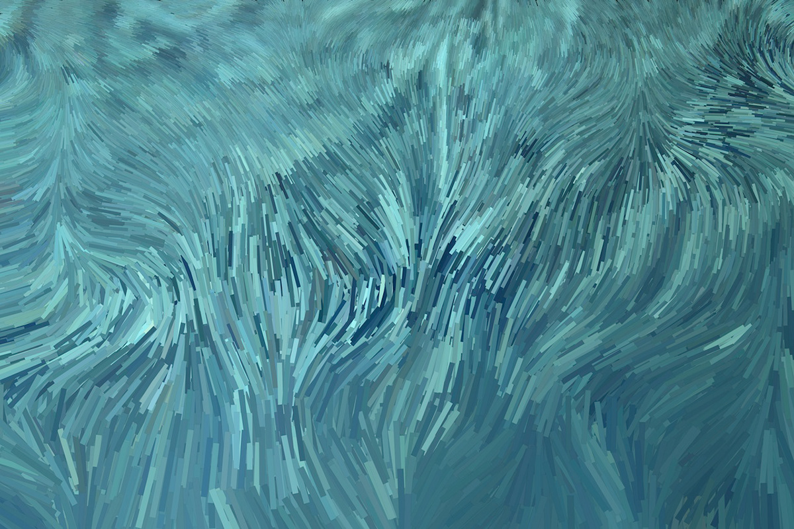

# szha3538_9103_tut3_Functioning-prototype

  
 - A visual representation showing perlin noise by Chris Riebschlager

>I was inspired by the digital artworks that create by Chris Riebschlager published on [*Behance*](https://www.behance.net/gallery/20450113/Noise-Haystacks?tracking_source=search_projects|perlin+noise&l=13) . These pictures shows that how to emulate landscapes and natural phenomena through coding and digital effects, creating visual textures and flows using algorithms and physically based simulations resulting in organic, wavy gradients and patterns.


## Part 1 - Interaction Instructions

The animation of this project starts immediately after the page is loaded. The animation is mainly divided into two parts. One part is the background animation of the page, which uses perlin noise as the basis for the gradient color flow. The second part is the animation of the overall movement of each unit circle, which is completed based on group assignment.

## Part 2 - Personal Approach to Group Code

For the basic animation of the group assignment, I adopted the following personal approach, focusing on generating dynamically changing gradients and natural forms, including coding methods, algorithm selection, and design principles:

#### 1. Coding method
I used the Perlin noise algorithm to drive the dynamic color and position changes in the animation. Perlin noise provides me with smooth and natural changes, which is closer to natural phenomena than traditional random number generation, making the gradient effect in the animation more fluid and coherent. By adding Perlin noise to the color and shape position, I was able to simulate the gradient effect of natural landscapes such as clouds and waves.

#### 2. Algorithm and design principles
I chose the Perlin noise algorithm because it can generate noise sequences with similarity of adjacent values ​​(smooth transition), avoiding the mutation effect generated by traditional random numbers. I also followed the gradient design principle, that is, through the layered ring structure and the gradual adjustment of RGB color values ​​in each layer, a soft color transition is created. In addition, through the time variable adjustment of noise in different frames, the color and shape of each layer change frame by frame, making the whole animation more delicate and vivid.

#### 3. Achieved goals and unique perspective
My goal is to show the gradient colors of natural landscapes through animation, so that the audience can associate it with the fluctuations of the sky, clouds or water surface. This dynamic gradient effect is not only beautiful, but also creates a peaceful and soothing atmosphere through the harmonious transformation of colors and shapes. Through this unique animation effect, I hope to explore the artistic beauty of gradients and noises in nature and stimulate the audience's interest in dynamic art.

## Part 3 - Animation

#### Animation Driver: 
In my code, Perlin noise is applied to the RGB values ​​of colors, the size of shapes, position offsets, and other aspects. For example, in the display method, Perlin noise generates position offsets (xOffset and yOffset) through the noise() function, so that the image position in each frame changes gradually, simulating a smooth wave-like movement effect. In addition, the code also uses Perlin noise to add different noise values ​​to the RGB components of each layer of diametColors to make the colors produce a natural gradient.

#### Animated Properties and Unique Differences:
##### 1. Color changes
My code adds noise to the RGB values ​​of each color layer through Perlin noise, so that the colors in diametColors can show smooth gradients frame by frame in the animation. This color change effect imitates natural clouds and water ripples, avoiding the incoherence caused by traditional random color jumps. The color gradient of each layer maintains a natural transition through Perlin noise, forming a coherent and flowing visual effect, while other team members may use fixed colors or time-based color switching, which is more stable in effect.

##### 2. Component resizing


My code uses Perlin noise to animate component resizing. In the drawThreeCircles and drawPattern methods, Perlin noise is added and the size of each circle is slightly adjusted based on the Perlin noise, making the component look like it is slowly "breathing" - gradually getting bigger and smaller. This resizing can simulate the spread of water waves or the pulsation of an organic form. Adding Perlin noise makes the animation more fluid and natural compared to the simple scaling that other team members may have adopted.

##### 3. Spiral animation


In my code, I added Perlin noise to the spiral animation, so that it has a dynamic expansion and contraction effect while rotating. Specifically, through the drawDynamicSpirals method, the noiseFactor generated by Perlin noise affects the angle and radius of the spiral, so that the spiral will show a "breathing" expansion and contraction effect when it rotates. This design imitates the spiral structure in nature, such as the vines of plants or the tentacles of marine creatures, making each turn of the spiral slightly different, and compared with the original small spiral effect, it looks more alive.

**Technical Explanation**

```javascript
class SpiralCircle {
    this.drawPattern(time);
    this.drawOuterRing(time);
    this.drawDynamicSpirals(time);

    // use perlin noise in x and y for Spiral animtaion movement
    let xOffset = noise(this.baseX * 0.01, time) * 50; // x offset for 'wave-like' movement
    let yOffset = noise(this.baseY * 0.01, time) * 50; // y offset for 'wave-like' movement
    let x = this.baseX + xOffset;
    let y = this.baseY + yOffset;
  }

```

##### 4. Selective display of components
In my code, the display order and gradient effect of each layer are dynamically controlled through Perlin noise. Rings of different layers are presented in the order of drawPattern and drawOuterRing, and the size and color changes of different rings are different. This layer- and noise-based display makes each frame slightly different, creating a visual effect similar to "changing with the wind" in nature, while other team members' animations may use a relatively fixed component display order and appearance method.


