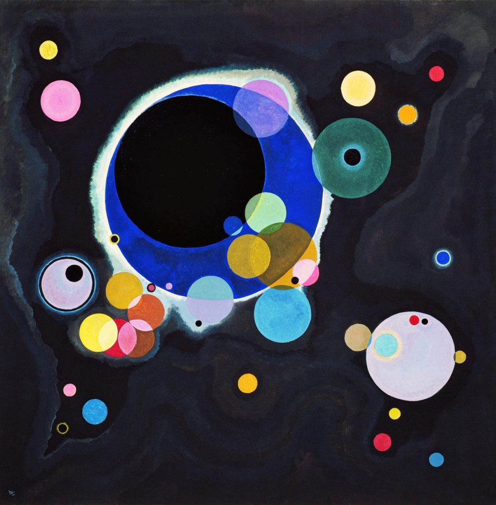

# szha3538_9103_tut3_Functioning-prototype

>I was inspired by the art work of Russian artist Wassily Kandinsky published in [*Lanntair*](https://lanntair.com/famous-artists-and-their-circles-2-wassily-kandinsky/) . The artwork that I was mainly inspired by was Kandinsky: Circles (1926). Kandinsky's work is very personal, using random lines and circles to create abstract art. I was inspired by it, first of all, his circles are layered and use transparency to add layers. Secondly, the circles give me a very free feeling, so in my subsequent iterations, I hope that my final work will also have free animation and reflect the sense of layering through changes in transparency and other colors.

  
 - A visual representation showing perlin noise by Chris Riebschlager


## Part 1 - Interaction Instructions

  

The animation of this project starts immediately after the page is loaded. The animation is mainly divided into two parts. One part is about the whole circle. Each circle contains animations that move its components. The second part is the animation of the inside of the circle based on the circle. As the page loads, the color of the circle will change gradually, showing different levels. The Spiral in the center of the circle will animate while rotating and stretching. At the same time, the dots on the surface of the circle will animate the diffusion.

## Part 2 - Personal Approach to Group Code

For the basic animation of the group assignment, I adopted the following personal approach, focusing on generating dynamically changing gradients and natural forms, including coding methods, algorithm selection, and design principles:

#### 1. Coding method
I used the Perlin noise algorithm to drive the dynamic color and position changes in the animation. Perlin noise provides me with smooth and natural changes, which is closer to natural phenomena than traditional random number generation, making the gradient effect in the animation more fluid and coherent. By adding Perlin noise to the color and shape position, I was able to simulate the gradient effect of natural landscapes such as clouds and waves.

#### 2. Algorithm and design principles
I chose the Perlin noise algorithm because it can generate noise sequences with similarity of adjacent values ​​(smooth transition), avoiding the mutation effect generated by traditional random numbers. I also followed the gradient design principle, that is, through the layered ring structure and the gradual adjustment of RGB color values ​​in each layer, a soft color transition is created. In addition, through the time variable adjustment of noise in different frames, the color and shape of each layer change frame by frame, making the whole animation more delicate and vivid.


## Part 3 - Animation

#### Animation Driver: 
In my code, Perlin noise is applied to the RGB values ​​of colors, the size of shapes, position offsets, and other aspects. For example, in the display method, Perlin noise generates position offsets (xOffset and yOffset) through the noise() function, so that the image position in each frame changes gradually, simulating a smooth wave-like movement effect. In addition, the code also uses Perlin noise to add different noise values ​​to the RGB components of each layer of diametColors to make the colors produce a natural gradient.

#### Animated Properties and Unique Differences:
##### 1. Color changes
In my code, Perlin noise is applied to various aspects such as the RGB values ​​of colors, the size of shapes, and position offsets. For example, in the display method, Perlin noise generates position offsets (xOffset and yOffset) through the `noise() function`, so that the image position gradually changes in each frame, simulating a smooth wave-like motion effect. The `diametColors` array is updated for each color channel (R, G, B) using Perlin noise, creating a gradient effect that changes smoothly over time. The values ​​are kept in the valid RGB range to ensure that the colors remain bright.

**Technical Explanation**

```javascript
    // Update diametColors using Perlin noise for a dynamic gradient effect
    for (let i = 0; i < this.diametColors.length; i++) {
      let rNoise = noise(this.baseX * 0.01, time * 0.5 + i) * 50;
      let gNoise = noise(this.baseY * 0.01, time * 0.5 + i + 10) * 50;
      let bNoise = noise((this.baseX + this.baseY) * 0.01, time * 0.1 + i + 20) * 50;

      let r = red(this.diametColors[i]) + rNoise - 25; 
      let g = green(this.diametColors[i]) + gNoise - 25;
      let b = blue(this.diametColors[i]) + bNoise - 25;

      // Limit color values to ensure they remain within valid RGB range
      this.diametColors[i] = color(constrain(r, 100, 255), constrain(g, 100, 255), constrain(b, 100, 255));
    }

```
##### 2. Fading the background for a smooth trail

The background color in `draw()` is semi-transparent, so each frame slightly fades the previous frame, creating a subtle trail effect and enhancing the dynamics of the animation.

**Technical Explanation**

```javascript
function draw() {
  background(2, 85, 122, 10); // Adding a transparency parameter makes the background color semi-transparent, creating a subtle trail effect.
  time += 0.01; // Increment time for smooth movement

  for (let i = 0; i < spiralCircles.length; i++) {
    spiralCircles[i].display(time); // Pass `time` to animate each SpiralCircle
  }
}
```

##### 3. Component resizing

My code uses Perlin noise to animate component resizing. In the `drawThreeCircles` and `drawPattern` methods, Perlin noise is added and the size of each circle is slightly adjusted based on the Perlin noise, making the component look like it is slowly "breathing" - gradually getting bigger and smaller. This resizing can simulate the spread of water waves or the pulsation of an organic form. Adding Perlin noise makes the animation more fluid and natural compared to the simple scaling that other team members may have adopted.

**Technical Explanation**

```javascript
function draw() {
  background(2, 85, 122, 10); // Adding a transparency parameter makes the background color semi-transparent, creating a subtle trail effect.
  time += 0.01; // Increment time for smooth movement

  for (let i = 0; i < spiralCircles.length; i++) {
    spiralCircles[i].display(time); // Pass `time` to animate each SpiralCircle
  }
}
```

##### 4. Spiral animation


In my code, I added Perlin noise to the spiral animation, so that it has a dynamic expansion and contraction effect while rotating. Specifically, through the `drawDynamicSpirals` method, the noiseFactor generated by Perlin noise affects the angle and radius of the spiral, so that the spiral will show a "breathing" expansion and contraction effect when it rotates. This design imitates the spiral structure in nature, such as the vines of plants or the tentacles of marine creatures, making each turn of the spiral slightly different, and compared with the original small spiral effect, it looks more alive.

**Technical Explanation**

```javascript
  drawDynamicSpirals(x, y, radius, time) {
    let spiralSize = radius * 0.8;
    let angleStep = TWO_PI / 20; // change this for tighter spirals
    let angleOffset = PI / 190; // shift the spiral

    stroke(255, 0, 0); // Solid red line
    strokeWeight(3.5);
    noFill();

    beginShape(); // Begin shape for drawing the spiral 
    for (let i = 0; i < 20; i++) {
      let noiseFactor = noise(x * 0.01, y * 0.01, time + i * 0.1);
      let angle = i * angleStep + time * 0.5 + angleOffset + noiseFactor * TWO_PI;
      let spiralX = x + cos(angle) * spiralSize * (i / 20) * noiseFactor;
      let spiralY = y + sin(angle) * spiralSize * (i / 20) * noiseFactor;
      vertex(spiralX, spiralY);
    }
    endShape();
  }

```

##### 4. Selective display of components
In my code, the display order and gradient effect of each layer are dynamically controlled through Perlin noise. Rings of different layers are presented in the order of `drawPattern` and `drawOuterRing`,`drawThreeCircles` and the size and color changes of different rings are different. This layer- and noise-based display makes each frame slightly different, creating a visual effect similar to "changing with the wind" in nature, while other team members' animations may use a relatively fixed component display order and appearance method.

**Technical Explanation**

```javascript
 drawThreeCircles(x, y, radius, time) {
    let sizes = [20, 13, 5];

    // Apply Perlin noise to slightly modify sizes over time for dynamic effect
    let sizeNoiseFactor = noise(x * 0.01, y * 0.01, time) * 5; // Adjust size using Perlin noise
    let dynamicSize1 = sizes[0] + sizeNoiseFactor;
    let dynamicSize2 = sizes[1] + sizeNoiseFactor;
    let dynamicSize3 = sizes[2] + sizeNoiseFactor;

    // Draw the three circles with dynamic sizes
    fill(255, 69, 0); // Orange
    noStroke();
    circle(x, y, dynamicSize1);

    fill(0); // Black
    noStroke();
    circle(x, y, dynamicSize2);

    fill(255); // White
    noStroke();
    circle(x, y, dynamicSize3);
  }

```

##### 5. Smooth motion using Perlin noise
Use Perlin noise to calculate `xOffset` and `yOffset` values ​​to produce a soft, wave-like motion, which adds a natural feel to the `SpiralCircle` object when animated.

**Technical Explanation**

```javascript
    // use perlin noise in x and y for Spiral animtaion movement
    let xOffset = noise(this.baseX * 0.01, time) * 50; // x offset for 'wave-like' movement
    let yOffset = noise(this.baseY * 0.01, time) * 50; // y offset for 'wave-like' movement
    let x = this.baseX + xOffset;
    let y = this.baseY + yOffset;

```

### Part 4:External Code or Techniques


#### 1. Constructor for Defining Basic Colors 
   - **Code Snippet:**  
     ```javascript
     constructor(x, y, diameter)
     ```
   - **Source:** [p5.js Documentation - Constructor](https://p5js.org/reference/p5/class/)  
   - **Description:**  
     The constructor function is used here to define the basic color properties for each object in the animation. This approach allows for organized initialization of object properties, which improves the structure and reusability of the code.  

#### 2. Constraining Color Values

   - **Code Snippet:**  
     ```javascript
     this.diametColors[i] = color(constrain(r, 100, 255), constrain(g, 100, 255), constrain(b, 100, 255));
     ```
   - **Source:** [p5.js Documentation - Constrain](https://p5js.org/reference/p5/constrain/)  
   - **Description:**  
     I used the `constrain()` function to limit RGB values, keeping colors within a specific brightness range. This technique ensures color consistency across the animation by restricting values between 100 and 255.

#### 3. Initializing Gradient Colors 
   - **Code Snippet:**  
     ```javascript
     this.diametColors = new Array(10).fill(this.baseColor);
     ```
   - **Source:** [W3Schools - JavaScript fill() Method](https://www.w3schools.com/jsref/jsref_fill.asp)  
   - **Description:**  
     The `fill()` method is used to initialize an array with gradient colors. By pre-filling the array with a base color, this approach allows for smooth color transitions in the animated elements, adding a cohesive gradient effect.

#### 4. Drawing Ellipses
   - **Code Snippet:**  
     ```javascript
     ellipse(x, y, currentDiameter);
     ```
   - **Source:** [p5.js Documentation - Ellipse](https://p5js.org/reference/p5/ellipse/)  
   - **Description:**  
     The `ellipse()` function is used to draw circular shapes in the animation, enhancing visual dynamics. This core shape function from p5.js provides a consistent way to render shapes across each frame of the animation.


